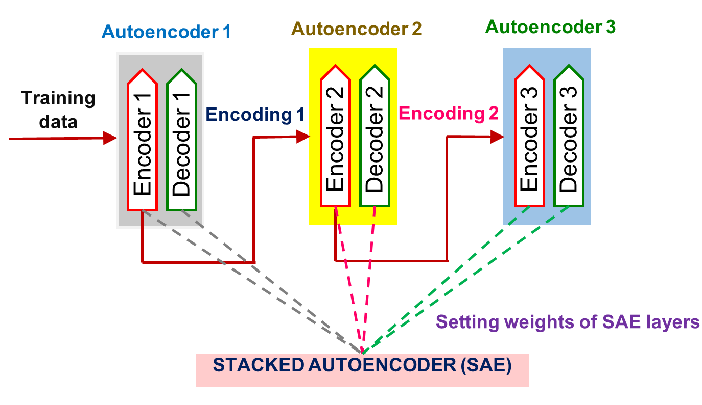
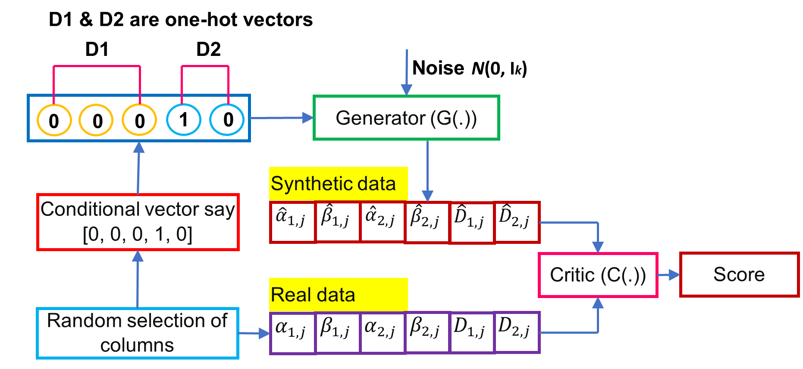

# EnsembleNTLDetect-An-Intelligent-Framework-for-Electricity-Theft-Detection-in-Smart-Grid

 
 

This repository contains the original implementation of the paper **[EnsembleNTLDetect: An Intelligent Framework for Electricity Theft Detection in Smart Grid](https://drive.google.com/file/d/11gttcNc8Va74b0u3TkosHt2aJO1_40Iy/view?usp=sharing)**, to be presented at ICDMW 2021.

If you find this code useful for your research, please cite the paper:

```
@INPROCEEDINGS{Yogesh_2021_ICDMW,
  author={Y. {Kulkarni} and S. {Hussain} and K. {Ramamritham} and N. {Somu},
  booktitle={2021 IEEE International Conference on Data Mining Workshops (ICDMW)}, 
  title={EnsembleNTLDetect: An Intelligent Framework for Electricity Theft Detection in Smart Grid}, 
  month = {},
  year={2021},
  volume={},
  number={},
  pages={},
  doi={}}
```
