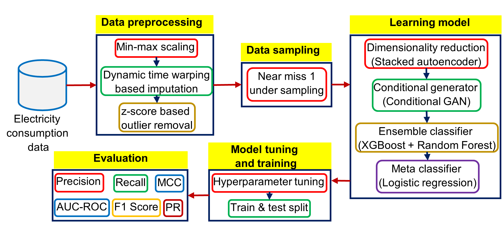

# EnsembleNTLDetect-An-Intelligent-Framework-for-Electricity-Theft-Detection-in-Smart-Grid

 
This repository contains the original implementation of the paper **[EnsembleNTLDetect: An Intelligent Framework for Electricity Theft Detection in Smart Grid](https://ieeexplore.ieee.org/document/9679840)**, presented at ICDM 2021.

If you find this code useful for your research, please cite the paper:

```
@INPROCEEDINGS{Yogesh_2021_ICDMW,
  author={Y. {Kulkarni} and S. {Hussain} and K. {Ramamritham} and N. {Somu},
  booktitle={2021 International Conference on Data Mining Workshops (ICDMW)}, 
  title={EnsembleNTLDetect: An Intelligent Framework for Electricity Theft Detection in Smart Grid}, 
  month = {December 2021},
  year={2021},
  pages={527-536},
  doi={https://doi.org/10.1109/ICDMW53433.2021.00070}}
```
